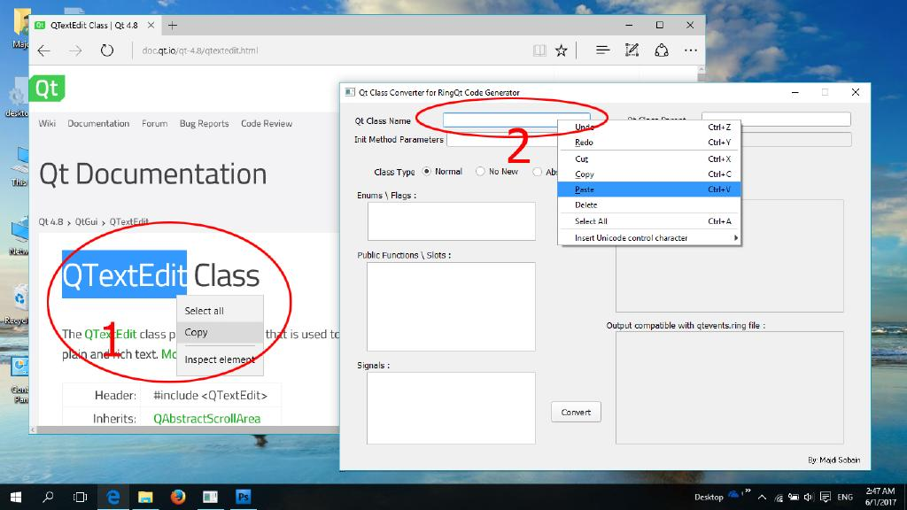
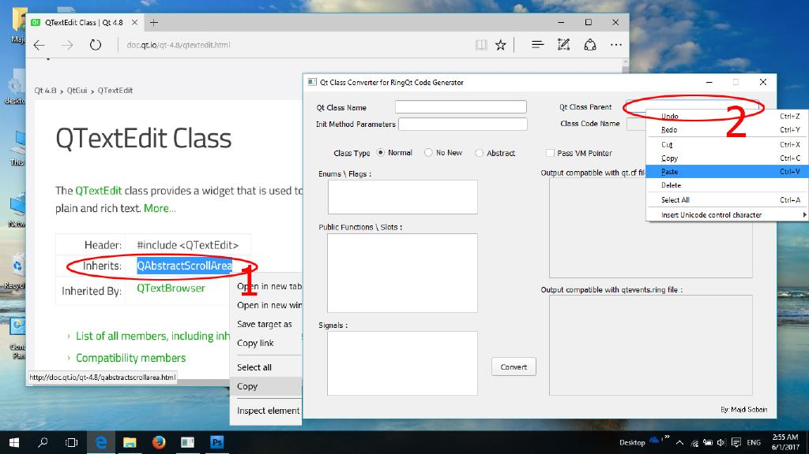
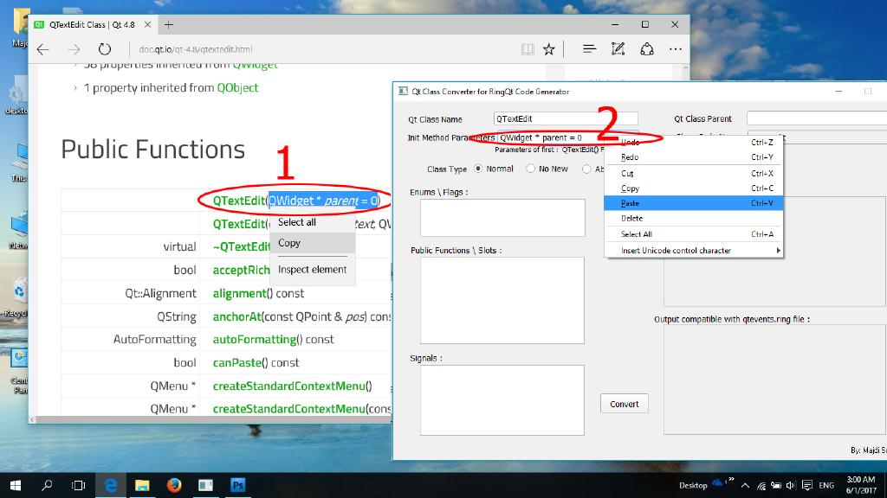
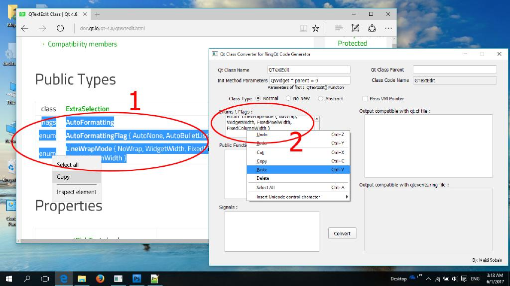
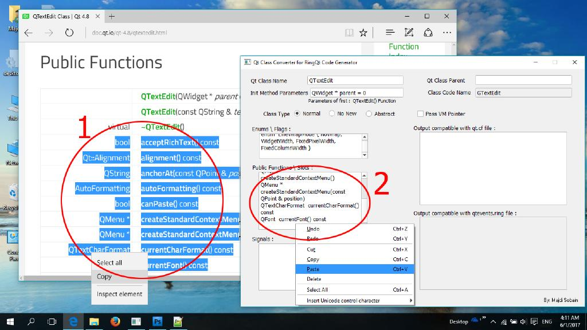
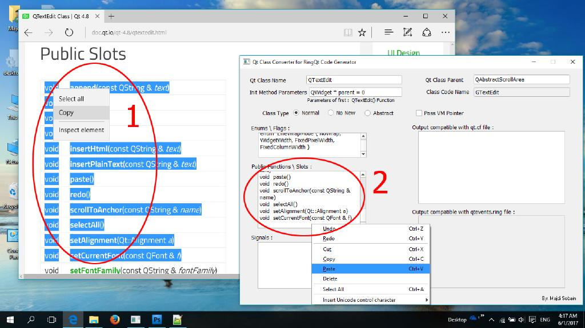
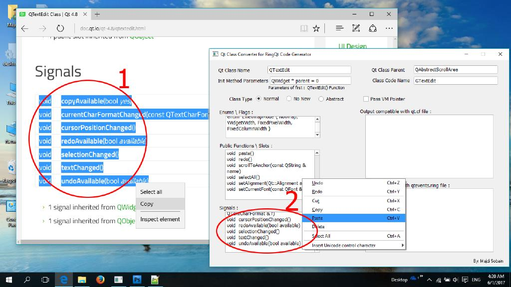

# Qt Class Converter for RingQt code generator

This is a nice tool that helps in implementation of new Qt classes into RingQt by converting Qt class functions prototype for easier and quicker implementation and building.

This tool has been made to reduce pain for those who are new to the Ring Extension Code Generator and Qt framework specifications. So that, this tool will do most of the work, simply by some mouse clicks and basic understanding of Ring and RingQt building process.

**Note:** This tool is a development continuation of ["qtclass2ringcodegen"](https://github.com/ring-lang/ring/tree/master/samples/tools/qtclass2ringcodegen) and ["setevents2getevents"](https://github.com/ring-lang/ring/tree/master/samples/tools/setevents2getevents) tools that have been developed by "Mahmoud Fayed (msfclipper@yahoo.com)".

## Features

1. Give the all required code for ringqt code generator in one place.

2. Auto creation of class codename.

3. Complete "qtevents.ring" class list creation.

4. Auto apply numerical additions for the functions of the same name (overriding functions).

5. Smart implementation of enums and flags to avoid duplication.

6. Auto creation of function standard substitution if there's a conflict with ring keyword.

7. Delete unnecessary functions automatically(initialization and delete functions, and operators functions).

## How to Use
1. **Be sure that the class you want to be added is not already present in RingQt**.

2. Open QtClassConverter application.

3. Search for Qt Class that is needed to be added, and open its documentation page.

4. Copy the class name from documentation page then paste it into "Class name" textbox in the application.

5. Copy class parent from documentation page, which could be found on the right side of "Inherits" word in the first table in the page, and paste it in the "Class parent" textbox of the application.

6. Copy parameters of the initialization function if present (the function that has the same name of the class), and paste it in the "Init method parameters" textbox. If there are more than one initialization function, just copy the parameters of the first one.

7. Copy enums and flags from documentation page and paste them into the "Enums \ Flags" textbox in the application.

8. Copy all public functions and slots from documentation page and paste them in the "Public Functions and Slots" textbox.

9. Copy all signals from documentation page and paste them in the "Signals" textbox.

10. You can check "Pass VM Pointer" checkbox if you have some signals because it's almost always used if they are present.

11. If the class that you want to convert does not need to be initialized, just check "No New" type from the class types above.

12. If the class that you want to convert is abstract class check "Abstract" type from the class type selection. To know whether the class is abstract or not you can easily figure it out if the class name contain "abstract" word, or you can discover that from reading the detailed description of the class.

13. Click "Convert" button to get output.

14. In the output textbox on the right side above. The first part above the line has to be copied and appended to included files list at the beginning of the "qt.cf" file. The output below line should be copied and append to the end of "qt.cf" file. "qt.cf" file is located in the "ringqt" extension folder.

15. The next output textbox on the right side below, should be copied and appended to the classes list in the "qtevents.ring" file that's located also in the "ringqt" extension folder. (just before the last square bracket, at the red point on the next picture)

16. Run the "gencode.bat" or "gencode.sh" to generate "ringqt" extension code with your new class included.

17. Build the extension. In case you want to build using "buildmingw32.bat" file you have to add filenames of new generated class "classname.cpp" and "classcodename.h" files into "ring_qt.pro" file (these files will only be generated if there's "codename" attribute in class definition). And be careful at adding ".cpp" filename that should be added before "ring_qt.cpp" line.

18. And You Are Done  :smiley:

